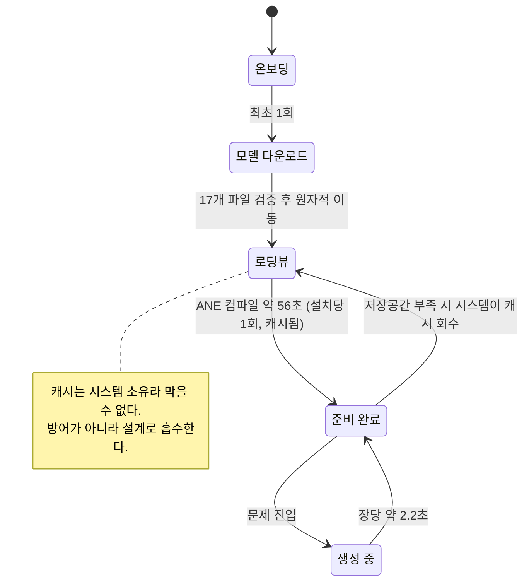
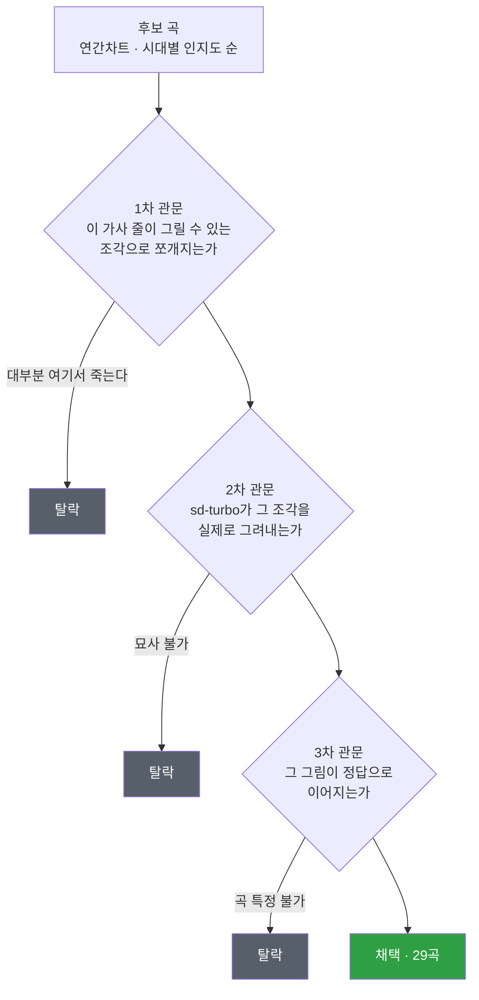

<div align="center">

# 🎵 픽송 (PicSong)

**온디바이스 diffusion 모델이 폰 안에서 가사 한 줄을 그림으로 그리면,<br/>그 그림을 보고 어떤 노래인지 맞히는 퀴즈 앱.**


서버 없음 · 클라우드 API 호출 없음 · 사전 생성 이미지 없음<br/>
**이미지는 사용자 폰에서, 문제를 푸는 그 순간에 만들어진다.**

</div>

---

## 한눈에

|  | |
|---|---|
| **목표** | 온디바이스 실시간 이미지 생성이 실제 폰에서 어디까지 되는지 직접 확인 |
| **결과** | **iPhone 13 mini(A15/4GB)에서 장당 2.2초.** 크래시·발열 없음 |
| **선례** | 착수 시점 *"iOS 실기기 CoreML sd-turbo 실시간 생성"* 사례를 찾지 못해 **직접 만들어 닫음** |
| **멈춘 지점** | 모델 성능이 아니라 **콘텐츠.** 그림으로 특정 가능한 곡이 안 모임 (채택 29 / 탈락 278) |
| **결론** | 소형 모델 온디바이스 생성은 **된다.** 다만 임의 텍스트를 식별 가능한 그림으로 옮기는 용도엔 묘사 폭이 부족하고, 병목은 추론이 아니라 **입력 확보** 쪽에 생긴다 |

> 이 저장소의 가치는 동작하는 파이프라인 절반, **"어디서 왜 막히는지를 수치로 남긴 기록"** 절반이다.
> 온디바이스 diffusion 자료는 대개 *"됩니다"* 데모에서 끝난다. 이 프로젝트는 그 다음 벽까지 갔다.

---

## 1. 아키텍처

### 생성 파이프라인


**시드를 곡·가사 위치에서 파생**시켜 같은 곡의 같은 가사는 언제나 같은 그림이 나오게 했다. 랜덤 시드는 묘사 적중률이 눈에 띄게 떨어져서, 재현성뿐 아니라 품질 문제이기도 했다.

### 준비 상태 — 56초를 어디서 받을 것인가

CoreML은 최초 1회 **ANE 컴파일**에 56초를 쓴다. 다운로드가 아니라 계산이고, **설치·업데이트당 1회**다.



**상태의 소유자는 네이티브 싱글톤**이다. Dart(뷰모델)에 "준비됨" 플래그를 복사해두면 화면 이탈·핫리스타트로 소멸하고, 그 대가가 **중복 컴파일 → 메모리 2배 → 크래시**다. 상태는 그 상태를 만들어내는 쪽이 소유한다.

**앱 스택:** Flutter 3.35 / Dart 3.6 · Bloc(Cubit) · go_router · Hive · flutter_hooks

---

## 2. 실기기 실측

**iPhone 13 mini (A15 / 4GB)** · 릴리즈 빌드 · 384×384 · 4 step · UNet 배치 1 · guidance 0.0 · `cpuAndNeuralEngine` + `reduceMemory`

| 항목 | 값 | 성격 |
|---|---|---|
| **이미지 1장 생성** | **~2.2초** | 매번 |
| 최초 파이프라인 준비 (ANE 컴파일) | ~56초 | **설치·업데이트당 1회.** 다운로드 아님 |
| 피크 메모리 | 622MB | `reduceMemory`로 모델 순차 로딩 |
| 앱 번들 | 1.2GB | 모델 1.0GB 포함 |
| 크래시 | **없음** | 발열도 없음 |

<details>
<summary><b>참고 — Mac M3 / 16GB (⚠️ 아이폰으로 전이되지 않는 수치)</b></summary>

| 경로 | 설정 | 시간 |
|---|---|---|
| PyTorch(diffusers)/MPS | 384px·4step·CFG0 | 1.5초/장 |
| CoreML+LCM/ANE | 384px·4step·**배치2**·guidance1.0 | 1.10초/장 (7.4 step/s) |
| **CoreML+LCM/ANE** | 384px·4step·**배치1**·guidance0.0 | **0.73초/장 (15.2 step/s)** |

**배치1이 step/sec 기준 2.07배.** 예측(2배)과 일치했다. 실시간은 1.5배에 그치는데, UNet이 아닌 부분(텍스트 인코딩·VAE 디코딩·파일 저장)은 절반이 안 되기 때문이다.

**배치1 vs 배치2 화질은 동일.** 픽셀 평균차 0.08~0.93/255로 전부 1 미만. 0이 아닌 이유는 배치2가 무조건부를 *계산 후 소거*하고 배치1은 *아예 생략*해서 부동소수점 반올림이 다르게 쌓이기 때문 — 수학적 동치가 맞다는 확인이다.

**M3 ANE ≠ A15 ANE.** 이 표를 아이폰 예상치로 쓰면 안 된다.
</details>

**변환 산출물 1.0GB** = TextEncoder 304MB + UNet 622MB + VAEDecoder 95MB
`quantize_weights()`는 text_encoder·unet만 6bit로 압축한다. VAE는 작고 화질 민감도가 높아 fp16으로 남긴다.
→ [`jivenchy/sd-turbo-coreml-384-6bit`](https://huggingface.co/jivenchy/sd-turbo-coreml-384-6bit) (무결성 17/17 검증)

---

## 3. 의사결정 기록

| # | 결정 | 대안 | 근거 |
|---|---|---|---|
| **D1** | 타겟 = **iPhone 13 mini+** (A15/4GB) | SE2 (A13/3GB) | SE2는 메모리·속도 부적합(~2.5배 느림). **보유 기기가 이것뿐** — 이 결정 하나가 모델·엔진·전략을 전부 파생시켰다 |
| **D2** | 모델 = **sd-turbo** (860M) | SD1.5 · SDXS · SANA | SD1.5와 같은 크기인데 few-step으로 **6배 빠름.** SDXS는 화질 열위 |
| **D3** | 엔진 = **CoreML** | s4nnc · MLX · DiffusionKit | MLX 공식 iOS 예제가 "6GB 전제" 명시, DiffusionKit은 아카이브됨. **4GB면 CoreML이 들어간다** |
| **D4** | 변환 = **자체 변환** | 기성 HF 변환본 | 기성본은 전부 ORIGINAL attention(Mac GPU용, ANE 불가)이거나 무압축 FP16(2.5GB). **CoreML 변환은 컴파일이라 조건이 박혀서 나온다** |
| **D5** | attention = **SPLIT_EINSUM v1** | V2 | V2는 latent 넓이가 **512의 배수**여야만 동작 → 384px 불가. 대가는 모바일 10~30% 속도 |
| **D6** | 해상도 = **384×384** | 512 · 256 | 실측 근거 아래 참조 |
| **D7** | 배포 = **HuggingFace 다운로드** | 앱 번들 동봉 | 번들 1.2GB를 200MB대로. 라이선스 원문 확인해 **재배포 허용** 확정 |
| **D8** | 아카이브 = **안 쓴다** | zip 묶어 배포 | 압축 이득 **2%**에 설치 중 피크 디스크 2배. 호스팅이 디렉터리를 보존해 묶을 이유가 없었다 |
| **D9** | 정답 = **주관식 유지** | 4지선다 | 대가는 곡 선별 기준이 최대로 엄격해지는 것. 그 대가가 결국 프로젝트를 멈춰 세웠다 |

<details>
<summary><b>D6 상세 — 클로즈업은 프롬프트가 아니라 캔버스 크기로 만든다</b></summary>

동일 프롬프트("택시가 다리 위를 달린다")로 해상도만 바꾼 결과:

| 해상도 | 결과 |
|---|---|
| 512px | 택시 **여러 대**, 전부 작게 (원경) |
| **384px** | **택시 한 대, 크게 — 목표 달성** |
| 256px | 택시 **앞부분만** 극단적 클로즈업 |

`close-up`·`single`·`large` 같은 단어는 sd-turbo가 **전부 무시한다.** 캔버스가 넓으면 모델이 빈 공간을 배경·사물로 채우고, 좁히면 주제 하나만 크게 그린다. 구도는 프롬프트가 아니라 해상도로 제어하는 파라미터였다.

**부수 제약:** latent = 픽셀÷8이고 UNet이 추가로 3회 다운샘플하므로 **64의 배수**여야 한다(300px은 애초에 불가). 애플 변환기는 픽셀이 아니라 latent 단위로 받는다(`--latent-h/-w`) → 384px = 48.
</details>

---

## 4. 트러블슈팅

문서에 안 나오고 **돌려봐야 나오는** 것들만 골랐다.

<details>
<summary><b>① 앱을 켤 때마다 56초 — 알고 보니 계측기가 만든 값</b></summary>

**증상** · 최초 1회로 알았던 ANE 컴파일 56초가 앱 실행마다 발생. "실행당 1분"을 전제로 설계를 시작할 뻔했다.

**원인** · `flutter run`이 **매번 앱을 재설치**하면서 번들 경로가 바뀌고, CoreML이 경로 기반 컴파일 캐시를 못 찾고 있었다. 애플 문서는 `.mlmodelc`가 컴파일을 캐시한다고 명시했는데, **우리가 그 문서의 전제(같은 경로)를 깨고 있었다.**

**해결** · 릴리즈로 설치하고 아이콘으로 실행 → 준비가 즉시 끝남. **콜드스타트는 릴리즈 설치 + 아이콘 실행으로만 측정한다.**

**교훈** · 이상한 수치가 나오면 **대상보다 계측기를 먼저 의심한다.** 문서가 "안 나온다"고 한 값이 나오면 내 쪽을 먼저 본다.
</details>

<details>
<summary><b>② 같은 교훈을 적어놓고 또 밟았다 — 대역폭 1/30 오측정</b></summary>

**증상** · 1GB 다운로드에 30분. *"회선이 느리다 → 백그라운드 다운로드가 필수다"*까지 설계 논리를 세웠다.

**원인** · 검증 스크립트가 **단일 연결 Python `urllib`**이었다. 같은 파일이 curl로 3.2MB/s, 병렬 클라이언트로 **17.6MB/s** — **실제의 1/30로 재고 있었다.** 바로 위 ①에서 "계측기를 의심하라"를 문서에 적어둔 다음이었다.

**해결** · 대역폭은 curl 또는 병렬 클라이언트로 잰다.

**교훈** · **교훈을 서술로 두면 안 걸린다. 금지 규칙으로 박아야 걸린다.** 그래서 "단일 연결로 대역폭 측정"을 번호 붙은 함정 항목으로 따로 박아뒀다. 그리고 — **결론이 맞았어도 근거가 틀렸으면 고쳐 적어야 한다.** 다음 사람이 그 근거를 믿고 다른 판단을 파생시킨다.
</details>

<details>
<summary><b>③ 변환기가 죽는다 — 마지막 줄만 봤으면 2GB를 재설치할 뻔</b></summary>

**증상** · `TypeError: only 0-dimensional arrays can be converted to Python scalars` — coremltools 변환 중 사망.

**원인** · 에러 마지막 줄만 보면 torch를 의심하게 된다(2GB 재설치). 스택을 끝까지 내려가니 `dtype(x.val)` 한 줄이 나왔고, 변환기가 `int(np.array([x]))`를 쓰는데 **numpy 2.0부터 이게 에러**였다.

**해결** · `numpy<2` 고정. 진범은 15MB짜리였다.

**교훈** · **에러의 마지막 줄이 아니라 스택 끝까지 본다.** 그리고 가설 검증은 **실패한 최소 단위로 되돌린다** — 40분짜리 전체 변환이 아니라 죽었던 VAE 디코더 하나만 1분에 돌려 판정했다.
</details>

<details>
<summary><b>④ 384px에서 텐서 크기 불일치 — V2가 나머지를 조용히 버린다</b></summary>

**증상** · SPLIT_EINSUM_V2로 변환하면 384px에서 텐서 크기 불일치로 사망.

**원인** · V2는 `CHUNK_SIZE=512`로 시퀀스를 자르며 **나머지를 조용히 버린다.** latent 넓이가 512의 배수가 아니면 깨진다. 384px는 48×48=2304 → 4.5청크라 불가.

**해결** · SPLIT_EINSUM **v1**. 정사각형 중 V2가 되는 건 256px·512px뿐인데, 둘 다 D6에서 탈락한 해상도였다.
</details>

<details>
<summary><b>⑤ guidance 0.0을 못 준다 — sd-turbo인데 CFG용 shape을 요구</b></summary>

**증상** · `--guidance-scale 0.0` 지정 시 `(1×1024×1×77) vs (2×...)` shape 에러.

**원인** · 애플 변환기 **기본값이 UNet 배치 2**(CFG 전제). sd-turbo는 CFG를 안 쓰는데도 매 스텝 무조건부를 계산하고 버리는 **헛일을 2배** 하고 있었다.

**해결** · `--unet-batch-one`으로 재변환 → step/sec **2.07배**, 화질은 동일(픽셀 평균차 1 미만). 재변환이 불가하면 guidance 1.0으로 우회 가능하다(수학적 동치, 2배 느림).
</details>

<details>
<summary><b>⑥ 프롬프트를 바꿔도 그림이 그대로 — 생성은 정상이었다</b></summary>

**증상** · 같은 시드로 다른 프롬프트를 넣었는데 이미지가 바뀌지 않는 것처럼 보임.

**원인** · `ClueGenerator.savePNG`가 파일명을 **시드로만** 만들어 같은 경로에 덮어썼고, **Flutter 이미지 캐시가 경로를 키로 쓰기 때문에** 첫 장을 계속 보여줬다. 생성 자체는 정상이었다.

**해결** · 파일명에 일련번호 추가. 진단 도구를 못 믿으면 진단 결과 전부를 못 믿는다.
</details>

<details>
<summary><b>⑦ 다운로드 CDN — 셋 다 실측으로만 드러났다</b></summary>

| 함정 | 실제 |
|---|---|
| CDN 리다이렉트 URL 캐싱 | 약 **1시간 뒤 403**. 이어받기는 항상 `resolve/main`부터 |
| 작은 파일은 리다이렉트 안 탄다고 가정 | **243바이트도 302다.** 전 요청 리다이렉트 추적 |
| 순차 다운로드로 만족 | **병렬이 3배 빠르다.** 5.5분 ↔ 1분 |

추가로, `Caches/`에 저장하면 시스템이 지우고(→ `Application Support`), 백업 제외 플래그를 빠뜨리면 iCloud에 1GB가 올라가 **심사에서 거부**된다.
</details>

---

## 5. 모델은 무엇을 못 그리는가 — 실증 목록

앱에 붙여둔 프롬프트 실험실 화면으로 실기기에서 배치 실험한 결과다. **횟수는 실제 시도 횟수다.**

| 대상 | 결과 |
|---|---|
| 두 사람의 일방적 관계 | "우산 씌워주기" **6회 전부 실패** — 각자 우산을 하나씩 든다 |
| **공중에 뜬 몸** (낙하·잠김) | **13장 전패.** `falling`·`skydiver`·`cliff diver`·거꾸로 자세·부감·실루엣을 다 시도. 정지 화면에서 낙하는 자세가 아니라 **배경과의 관계로만 읽히는데** 그 관계가 조합되지 않는다. 우회로는 **사물을 주인공으로 세우는 것** 하나뿐 (`a parachute open in the sky, a person hanging below it` — 채택) |
| **눈물** | **4건 전부 실패.** 얼굴 주어·눈 주어·단수·복수·`crying`·접촉면 명시를 다 시도. 색 단어를 넣으면 속성 결합 실패로 피처럼 나오고, 빼면 아무것도 안 나온다 |
| 착용물 (스타킹류) | 사람에게서 떼면 형태가 안 서고, 사람을 넣으면 사물이 죽는다. 신발은 **단수 프레이밍이면 가능**했다 |
| 연속 동작 | "쓰러지고 다시 일어나" — 한 장에 두 시점 불가 |
| 변신 | "별이 반딧불이 되다" — 결과 상태만 그린다 |
| 향기·맛·촉감 | 그릴 수 없다 |

여기서 프롬프트 규칙 19개가 파생됐다. 몇 가지만:

- **부정 표현은 무시된다** — 빼고 싶으면 아예 언급하지 않는다
- **색을 특정 사물에 묶으려 하지 말 것** — 속성이 다른 사물로 새어나간다
- **추상어는 그것이 남긴 물리적 증거로 번역한다**
- **상태를 지시하지 말고, 그 상태가 당연한 상황을 준다**
- **학습 데이터에 드문 지역 사물은 못 그린다** — 「밤양갱」이 근거다. 제목이 곧 구체적 사물이라 이상적인 후보였는데, **모델이 양갱을 모른다**

---

## 6. 왜 멈췄나 — 진짜 병목은 모델이 아니라 콘텐츠였다

**그림은 나온다. 그런데 그 그림으로 곡을 못 맞힌다.**

실기기 통합 직후 발견했고, 생성 품질 문제가 아니었다. 성립하는 판은 전부 **제목의 구체적인 사물이 그림에 등장한** 경우였다. 감정이나 분위기를 아무리 정확하게 그려도 곡을 특정하지 못한다 — "눈물 흘리며 웃는 여자"가 잘 그려져도 그런 노래는 수백 곡이다.

그래서 곡 선별이 이 프로젝트의 최대 공정이 됐다.



| | 곡 수 |
|---|---|
| **채택** — [`assets/data/songs.json`](assets/data/songs.json) | **29곡** · 80~90년대 7 · 2000년대 7 · 2010년대 6 · 2020년대 9 |
| **탈락** | **278곡** · 2020s 20 · 2010s 82 · 1990s 116 · 1980s 60 |

탈락 목록은 *검토까지 간* 곡만 센 것이라, 후보로 읽고 버린 수는 이보다 훨씬 많다. 특히 **1990년대는 발라드 시대라 인지도 순으로 뒤지면 전멸**했고, **2010년대 아이돌 댄스곡도 G1을 통과하지 못했다.** 시대별로 20곡씩 모으는 건 이 방식으로는 도달할 수 없는 목표였다.

**제품으로 낼 거였다면** 클라우드 모델로 미리 뽑아 저장해 쓰는 게 맞다. 이 프로젝트의 목적은 그 판단을 **감이 아니라 수치로 확인하는 것**이었고, 그건 끝냈다.

---

## 7. 과정에서 배운 것

- **"온디바이스 메모리 불가능"의 주어는 기기가 아니라 엔진이었다.** 조사 단계 결론은 "4GB 아이폰에선 못 돈다"였는데, 그건 방치된 CoreML 저장소 얘기였다. 다른 엔진으로 **코드 0줄 짜고** 기존 앱(Draw Things)에서 실측하니 256px 4step이 13초에 발열 없이 돌았다. → **몇 주짜리 네이티브 빌드 전에 최대 리스크부터 싸게 검증한다.**

- **질문을 잘못 던지면 조사가 헛발질한다.** *"sd-turbo를 SE2에서"* 로 좁히니 막다른 결론만 나왔다. *"살아있는 경로 + 진짜 최소기기"* 로 다시 던지니 후보가 드러났다.

- **"선례"는 실행 환경까지 확인해야 선례다.** 한 프로젝트를 "CoreML 실시간 작동 증거"로 일주일 믿었는데, README를 한 번 읽으니 **macOS + Unity**였다. 무엇이 되느냐보다 **어디서** 되느냐를 먼저 본다.

- **대조군 없이는 실패의 주어를 못 정한다.** CoreML 결과에서 칵테일잔이 찻잔으로 나왔을 때, PyTorch로 같은 프롬프트를 미리 뽑아두지 않았다면 "CoreML이 망가뜨렸다"고 오판했을 것이다. 그건 **sd-turbo 원래 한계**였다. 새 파이프라인을 검증할 땐 **바꾸는 것 하나만 빼고 전부 동일한 기준선**을 먼저 만든다.

- **느린 게 어디가 느린지부터 나눈다.** "56초 걸린다"를 통째로 보면 손댈 데가 없다. 다운로드/디스크 읽기/계산으로 나누니 ANE 컴파일이 나왔고, 그러자 "1회성이고 캐시된다"는 **성질**이 따라 나왔다. 성질을 알아야 설계가 나온다 — 숨길 수 있는 비용인지 매번 내야 하는 비용인지가 갈린다.

- **원인을 확정하기 전에 큰 변경에 착수하지 않는다.** 56초가 재발했을 때 "모델을 다운로드 방식으로 바꾸면 해결된다"로 곧장 갈 뻔했다. 후보를 넷으로 나눠 확인하니 원인은 **저장 공간**이었고, 그 변경은 저장 공간을 **1바이트도 줄이지 않는다.**

- **"추정 확정"은 확정이 아니다.** 지난 세션의 추정 3개가 다음 세션에 각각 참·거짓·거짓으로 갈렸다. 기록에는 **추정과 확인을 표기로 구분**해야 다음 사람이 헛디디지 않는다.

---

## 8. 프로젝트 구조

```
lib/
├── data/            # Hive · Dio · Service (clue · model · song)
├── domain/          # 엔티티 · 순수 도메인 로직 (round · scoring)
├── presentation/    # 화면 · Cubit · 디자인 시스템 · 라우터
└── utils/
```

**화면 흐름** — 스플래시 → 온보딩 → 모델 다운로드 → 홈 → 라운드 준비 → 문제 → 라운드 결과

여기에 더해 **프롬프트 실험실**이라는 진단용 화면을 한동안 앱에 넣고 굴렸다. 프롬프트·시드를 바꿔가며 실기기에서 배치 생성해보는 개발용 도구로, **§5의 실증 목록이 전부 여기서 나왔다.** 처음부터 "원인 규명이 끝나면 제거한다"는 조건으로 만든 화면이라, 진단이 끝난 뒤 제거했다.

실험실을 **맥이 아니라 앱 안에** 만든 이유가 있다. 맥에서 수백 장을 뽑아 다듬은 프롬프트가 실기기에선 다르게 나왔다 — **진단은 반드시 최종 실행 환경에서 한다.**

---

## 9. 실행

```bash
flutter pub get
flutter analyze
```

> **이미지 생성은 iOS 실기기에서만 동작한다** (CoreML + ANE). 시뮬레이터·안드로이드는 미지원이고, 배포 타겟은 **iOS 16.2+**(`StableDiffusion` 패키지 최소사양)다.
> 모델 변환 환경을 재현할 때는 **`numpy<2` 고정이 필수**다(트러블슈팅 ③).

---

## 10. 라이선스 고지

**Powered by Stability AI.**

이 프로젝트가 사용하는 sd-turbo는 **Stability AI Community License**(2024-07-05판)를 따르며, **비상업 트랙**으로 이용한다. 변환한 파생 모델은 [HuggingFace 저장소](https://huggingface.co/jivenchy/sd-turbo-coreml-384-6bit)에 라이선스 사본 · `NOTICE` · 변경 방법과 함께 공개돼 있다.
